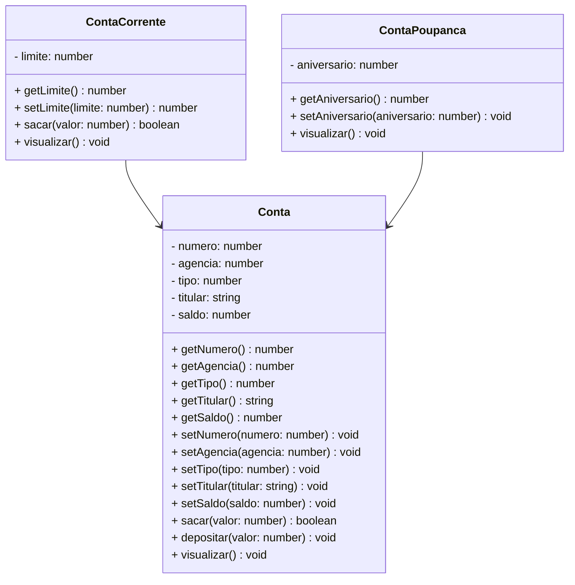

# Projeto Conta Bancária - Typescript

 

   

 

## Descrição

Aplicativo Console, desenvolvido com a Linguagem TypeScript, com o objetivo de simular um Sistema de Gerenciamento de Contas Bancárias, utilizando os recursos básicos da linguagem TypeScript e o Paradigma da Programação Orientada a Objetos. Para armazenar os dados das Contas foi utilizada a Collection Array, que permite manter os dados em memória durante a execução da aplicação.

O Sistema permite realizar todas as Operações do CRUD (Create, Read, Update e Delete), com os Objetos das Classes Conta Corrente e Conta Poupança, além das Operações Bancárias Básicas (Saque, Depósito e Transferência entre Contas).

 

## Diagrama de Classes

 

## Bibliotecas

- npm install -g typescript
- npm install -g ts-node
- npm install prompt-sync
- npm install @types/prompt-sync
- npm install --save-dev @types/node
- npm install readline-sync

 

## Executar o projeto

1. Abra o Terminal
2. Digite o comando: `npm install` na pasta raiz do projeto para instalar as Bibliotecas.
3. Digite o comando: `tsc --init` para inicializar o TypeScript.
4. Digite o comando `ts-node Menu.ts` para executar o projeto.

 

## Menu do Projeto

   

